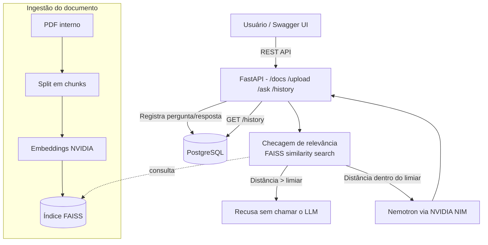

# Agente de IA para Documentos Internos (RAG) — Santo Pegasus v2.0

# Autor: Carlos Magno Galindo Cordeiro

# Linkedin: https://www.linkedin.com/in/carlosmagnogcs/

Agente de Inteligência Artificial que responde perguntas em linguagem natural sobre documentos internos da empresa (políticas, manuais, relatórios), usando **RAG (Retrieval-Augmented Generation)**. Projeto desenvolvido para o desafio **Alura/Oracle — Agente de IA com deploy na OCI**.

**v2.0** — reestruturado com **FastAPI**, **Frontend visual (Chat e Dashboard Analítico)**, **Kubernetes manifests**, e persistência de histórico de respostas no PostgreSQL.

---

## Arquitetura



**Fluxo de escopo em duas camadas:**

1. **Relevância por similaridade** — se a distância do trecho mais próximo no índice FAISS ultrapassar um limiar, a pergunta é recusada **sem gastar chamada de API**.
2. **Prompt rígido no LLM** — segunda linha de defesa: o modelo é instruído a nunca usar conhecimento externo e a recusar perguntas sem relação real com o contexto recuperado, mas pode responder parcialmente quando só uma parte da pergunta não é determinável pelo documento.

---

## Stack técnica

| Camada                     | Tecnologia                                               |
| -------------------------- | -------------------------------------------------------- |
| Frontend Visual            | HTML5, CSS3 (Glassmorphism), Vanilla JS, Chart.js        |
| API REST + Swagger         | FastAPI (Swagger UI em `/docs`)                          |
| Orquestração do agente     | LangChain (LCEL)                                         |
| Modelo de linguagem        | NVIDIA Nemotron (via NVIDIA NIM / build.nvidia.com)      |
| Embeddings                 | NVIDIA `nv-embedqa-e5-v5`                                |
| Índice vetorial            | FAISS                                                    |
| Banco de dados             | PostgreSQL 16 (Alpine)                                   |
| Containerização            | Docker + Docker Compose                                  |
| Orquestração (K8s)         | Kubernetes (Kustomize)                                   |
| Infraestrutura como código | Terraform (provider OCI)                                 |
| Configuração e deploy      | Ansible (+ Ansible Vault para segredos)                  |
| Nuvem                      | Oracle Cloud Infrastructure (OCI Compute, ARM Ampere A1) |

---

## Estrutura do repositório

```
.
├── CLAUDE.md                              # Guia para agentes de IA (convenções, deploy)
├── docker-compose.yml                     # Dev local: FastAPI + Postgres
├── apps/                                  # Código fonte
│   └── backend/
│       └── rag-agent/
│           ├── api.py                     # FastAPI (Swagger em /docs)
│           ├── agent.py                   # Chain RAG: prompt, escopo, checagem
│           ├── loader.py                  # Leitura e chunking do PDF
│           ├── vectorstore.py             # Índice FAISS
│           ├── db.py                      # Persistência PostgreSQL + histórico
│           ├── static/                    # Frontend (HTML, CSS, JS, Chart.js)
│           ├── Dockerfile                 # Imagem da aplicação
│           ├── requirements.txt           # Dependências Python
│           └── db-init/
│               └── 01_criar_tabela.sql    # Schema inicial
├── kubernetes/                            # Manifests K8s
│   ├── kustomization.yaml
│   ├── backend/
│   │   ├── deployment.yaml
│   │   ├── service.yaml
│   │   └── pdb.yaml
│   └── postgres/
│       ├── statefulset.yaml
│       ├── service.yaml
│       └── configmap.yaml
├── terraform-iac/                         # Infraestrutura OCI (Terraform)
│   ├── ansible/                           # Playbooks de deploy
│   └── ...
└── docs/                                  # ADRs e documentação
```

---

## Endpoints da API

| Método | Rota       | Descrição                                           |
| ------ | ---------- | --------------------------------------------------- |
| GET    | `/health`  | Healthcheck (K8s probes)                            |
| POST   | `/upload`  | Upload de PDF → indexação → retorna `session_id`    |
| POST   | `/ask`     | Pergunta sobre o documento (requer `session_id`)    |
| GET    | `/stats`   | Retorna estatísticas agregadas por dia para o gráfico |
| GET    | `/history` | Painel de histórico de respostas (paginação/filtros) |

**Interface Visual** — acesse `http://localhost:8000/` para a interface principal (Chat e Dashboard).  
**Swagger UI** — acesse `http://localhost:8000/docs` para testar a API.

---

## Como rodar localmente

### Pré-requisitos

- Docker e Docker Compose
- Uma API Key gratuita da NVIDIA NIM ([build.nvidia.com](https://build.nvidia.com))

### Passos

```bash
git clone <url-deste-repositorio>
cd <pasta-do-projeto>

# Variáveis de ambiente
cp .env.example .env
nano .env   # preencha NVIDIA_API_KEY e POSTGRES_PASSWORD

# Subir a stack completa (Postgres + FastAPI)
docker compose up -d --build
docker compose ps   # aguarde "healthy" nos dois serviços
```

Acesse:
- **Interface Principal:** [http://localhost:8000/](http://localhost:8000/) (Chat RAG e Dashboard)
- **Swagger UI:** [http://localhost:8000/docs](http://localhost:8000/docs)

---

## Deploy no Kubernetes

### 1. Criar Secret

```bash
kubectl create secret generic rag-agent-secrets \
  --from-literal=nvidia-api-key='nvapi-sua-chave' \
  --from-literal=postgres-password='senha-segura'
```

### 2. Aplicar manifests

```bash
kubectl apply -k kubernetes/
```

### 3. Verificar

```bash
kubectl get pods -l app.kubernetes.io/part-of=challenge-k8s-pro
kubectl get svc rag-agent
```

---

## Deploy na OCI — passo a passo

A implantação segue o padrão **infraestrutura como código + configuração como código**: o Terraform cria os recursos de nuvem; o Ansible instala o Docker, sincroniza o projeto e sobe a aplicação.

### 1. Provisionar infraestrutura (Terraform)

```bash
cd terraform-iac
cp terraform.tfvars.example terraform.tfvars
nano terraform.tfvars

terraform init
terraform plan
terraform apply
```

### 2. Configurar segredos (Ansible Vault)

```bash
cd ansible
ansible-galaxy collection install -r requirements.yml

cp group_vars/all/vault.yml.example group_vars/all/vault.yml
nano group_vars/all/vault.yml
ansible-vault encrypt group_vars/all/vault.yml
```

### 3. Deploy (Ansible)

```bash
ansible-playbook playbook.yml --ask-vault-pass
```

---

## Exemplos de perguntas e respostas

**Dentro do escopo:**

> **Pergunta:** Qual o SLO da Santo Pegasus?
> **Resposta:** O SLO da Santo Pegasus é 99,9% (Three Nines), medido em uma janela móvel de 30 dias.

> **Pergunta:** Um aumento súbito de erros HTTP 500 no módulo de agendamento configura um incidente? Qual seria a severidade?
> **Resposta:** Sim, isso configura um incidente segundo o documento. Quanto à severidade específica, o documento não atribui uma classe SEV fixa a esse cenário genérico — a classificação dependeria de fatores como percentual de usuários afetados, impacto financeiro e risco clínico, conforme os critérios da Matriz de Severidade.

**Fora do escopo:**

> **Pergunta:** Qual a capital da França?
> **Resposta:** Não tenho essa informação no documento. Minha função é responder apenas sobre o conteúdo do manual interno carregado.

---

## Painel Visual e Histórico

A aplicação conta com um **Frontend Visual** acessível na raiz (`/`):
- **Interface de Chat:** Permite o upload interativo do PDF e conversação com respostas renderizadas e status de relevância (Dentro/Fora do Escopo).
- **Dashboard Analítico:** Exibe as métricas de performance (Acurácia), e um **gráfico de barras (Chart.js)** mostrando a relação diária de acertos e erros.
- **Tabela de Histórico:** Mostra as últimas interações e permite abrir um modal detalhado (pergunta, resposta, fontes consultadas e distância FAISS).

O histórico completo continua acessível programaticamente via API:
```bash
# Últimas interações
curl http://localhost:8000/history

# Estatísticas agregadas (para gráficos)
curl http://localhost:8000/stats
```

---

## Troubleshooting

| Sintoma                                                   | Causa                                                                                                             | Solução                                                      |
| --------------------------------------------------------- | ----------------------------------------------------------------------------------------------------------------- | ------------------------------------------------------------ |
| `manifest for mariadb:11.4-alpine not found`              | Imagem oficial do MariaDB não publica tag Alpine                                                                  | Projeto usa `postgres:16-alpine` (tag oficial válida)        |
| Ansible: `hosts list is empty`                            | Projeto rodando em pasta montada do Windows (`/mnt/c/...`), Ansible ignora `ansible.cfg` por ser "world writable" | Mover o projeto para dentro do WSL (`~/`)                    |
| Agente recusa perguntas dentro do escopo                  | Limiar de relevância muito baixo, ou prompt rígido demais para perguntas que exigem síntese                       | Calibrar o slider de limiar; revisar o prompt em `agent.py`  |
| `Python 'float32' cannot be converted` ao salvar no banco | FAISS retorna `numpy.float32`, driver do banco não serializa                                                      | Conversão explícita para `float()` nativo antes de persistir |

---

## Critérios do desafio atendidos

- ✅ Leitura e processamento de documento (PDF)
- ✅ Agente de IA responde perguntas em linguagem natural sobre o documento
- ✅ Implantação na nuvem (OCI), acessível publicamente
- ✅ Código organizado em módulos, com histórico de commits
- ✅ Frontend Visual premium (Dashboard analítico com Chart.js e interface de Chat)
- ✅ API REST com Swagger para teste (FastAPI `/docs`)
- ✅ Manifests Kubernetes prontos para produção
- ✅ Painel de histórico de respostas via API e Gráfico
- ✅ README com arquitetura, exemplos de Q&A e instruções de execução